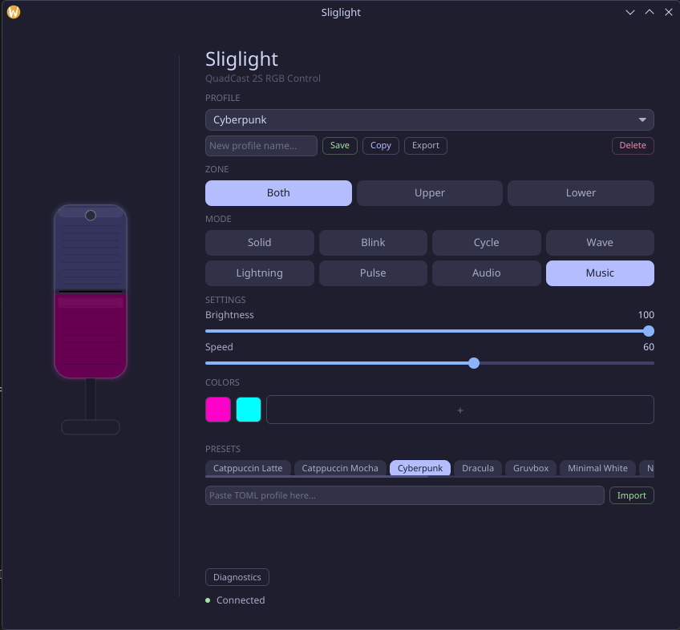

<div align="center">

# Sliglight

**RGB lighting control for HyperX QuadCast microphones on Linux**

A pure Rust application with a native GUI, CLI, and first-class NixOS integration for controlling the LED rings on HyperX QuadCast S, QuadCast 2S, DuoCast, and related USB microphones.

[](https://www.gnu.org/licenses/old-licenses/gpl-2.0.en.html)
[](https://www.rust-lang.org/)
[](https://nixos.org/)
[](https://iced.rs/)

---



*Cyberpunk profile with Music mode — live mic preview, per-zone control, audio-reactive LEDs, and profiles.*

</div>

---

## Overview

HyperX NGenuity, the official RGB control software for QuadCast microphones, is Windows-only and closed-source. Sliglight is a from-scratch reimplementation of the USB HID protocol that lets you control all 108 LEDs across both mic rings directly from Linux -- no Wine, no VMs, no cloud accounts.

It ships as a Nix flake with a NixOS module that handles udev rules, non-root USB access, and an optional systemd user service to restore your color on boot.

## Features

- **8 animation modes** -- Solid, Blink, Cycle, Wave, Lightning, Pulse, Audio-reactive, Music-reactive
- **Audio-reactive LEDs** -- mic input VU meter and desktop audio color-breathing synced to music via PipeWire/PulseAudio
- **Mute indicator** -- LEDs flash red when mic is muted, restore on unmute
- **Per-zone control** -- upper and lower LED rings (54 LEDs each, 108 total)
- **Adjustable brightness and speed** -- fine-grained sliders for each parameter
- **Up to 11 colors** -- full palette with inline hex RGB editor
- **Live mic preview** -- real-time canvas rendering of current LED state
- **Profiles** -- 13 built-in profiles (Catppuccin, Nord, Dracula, Gruvbox, etc.) plus custom save/copy/import/export
- **Live updates** -- every control change takes effect instantly, no Apply button
- **Config persistence** -- settings saved to `~/.config/sliglight/config.toml` (XDG compliant)
- **DBus API** -- `org.sliglight.Daemon` for scripting and Waybar/i3blocks integration
- **System tray** -- KDE StatusNotifierItem with profile switching, on/off toggle, mute status
- **Screen lock blackout** -- LEDs turn off when screen locks, restore on unlock
- **CLI for scripting** -- headless operation, suitable for cron jobs or shell scripts
- **NixOS module** -- declarative configuration with udev rules and systemd service
- **Catppuccin Mocha theme** -- native dark theme, no toolkit theming required

## Supported Devices

| Device | Vendor | VID:PID | Status |
|--------|--------|---------|--------|
| HyperX QuadCast S | Kingston | `0951:171f` | Fully supported |
| HyperX QuadCast 2S | HP | `03f0:02b5` | Fully supported |
| HyperX DuoCast | HP | `03f0:0f8b` | Supported |
| HP-branded variants | HP | `03f0:028c`, `048c`, `068c`, `098c`, `0d84` | Supported |

The USB driver auto-detects connected devices by scanning for known vendor/product ID pairs.

## Installation

### NixOS (Flake)

Add the flake input to your `flake.nix`:

```nix
{
  inputs = {
    nixpkgs.url = "github:NixOS/nixpkgs/nixos-unstable";
    nix-quadcast.url = "github:htelsiz/nix-quadcast";
  };

  outputs = { nixpkgs, nix-quadcast, ... }: {
    nixosConfigurations.myhost = nixpkgs.lib.nixosSystem {
      modules = [
        nix-quadcast.nixosModules.default
        {
          hardware.quadcast.enable = true;

          # Optional: persistent color applied on login via systemd user service
          # hardware.quadcast.color = "ff0000";
          # hardware.quadcast.mode = "solid"; # solid, blink, cycle, wave, lightning, pulse
        }
      ];
    };
  };
}
```

This provides:
- `sliglight` (GUI) and `sliglight-cli` binaries on your PATH
- udev rules granting non-root access to QuadCast USB devices
- An optional systemd user service that applies your chosen color at login

### Standalone (nix run)

Try it without installing:

```bash
nix run github:htelsiz/nix-quadcast
```

## Usage

### GUI

```bash
sliglight
```

The GUI provides a live preview canvas showing both LED rings, zone selection, animation mode picker, brightness/speed sliders, and a color palette with up to 11 entries and inline hex editing.

### CLI

```bash
# Solid color
sliglight-cli solid ff0000

# Cycle through multiple colors
sliglight-cli cycle ff0000 00ff00 0000ff

# Wave with custom brightness and speed
sliglight-cli wave ff0000 --brightness 50 --speed 80

# Pulse with a multi-color palette
sliglight-cli pulse ff6600 00ccff 9933ff --brightness 75

# Lightning effect
sliglight-cli lightning ffffff --speed 90
```

| Flag | Description | Range |
|------|-------------|-------|
| `--brightness` | LED brightness | 0 -- 100 |
| `--speed` | Animation speed | 0 -- 100 |

Colors are 6-digit hex RGB values without a `#` prefix.

## Architecture

```
nix-quadcast/
  crates/
    sliglight-usb/       USB HID protocol driver (rusb)
    sliglight-core/      Animation engine + CLI binary
    sliglight-gui/       iced 0.14 GUI application
  flake.nix              Nix flake: packages, NixOS module, overlay
  module.nix             NixOS module with udev rules + systemd service
  gui-package.nix        Nix derivation (rustPlatform.buildRustPackage)
```

**sliglight-usb** -- Low-level USB HID communication built on `rusb`. Device discovery, interface claim/release, and the binary protocol for writing LED frames to the control endpoint.

**sliglight-core** -- Animation engine translating mode descriptions into per-LED color frames at 30fps. Provides `sliglight-cli` for command-line operation.

**sliglight-gui** -- Native GUI built with [iced](https://iced.rs/) 0.14. Real-time mic preview canvas, Catppuccin Mocha theme, zone/mode/color controls.

## Building from Source

### With Nix

```bash
git clone https://github.com/htelsiz/nix-quadcast.git
cd nix-quadcast
nix build
./result/bin/sliglight
```

### With Cargo

Requires `libusb-1.0` development headers:

```bash
# Debian/Ubuntu
sudo apt install libusb-1.0-0-dev pkg-config cmake

# Fedora
sudo dnf install libusb1-devel pkg-config cmake

# Arch
sudo pacman -S libusb pkgconf cmake
```

```bash
git clone https://github.com/htelsiz/nix-quadcast.git
cd nix-quadcast
cargo build --release
./target/release/sliglight      # GUI
./target/release/sliglight-cli  # CLI
```

Non-root USB access requires udev rules. See `module.nix` for the rule definitions.

## Contributing

Contributions are welcome. If you have a QuadCast variant not listed in the supported devices table, open an issue with the output of `lsusb` and we can add detection for it.

## License

[GNU General Public License v2.0](https://www.gnu.org/licenses/old-licenses/gpl-2.0.en.html)
